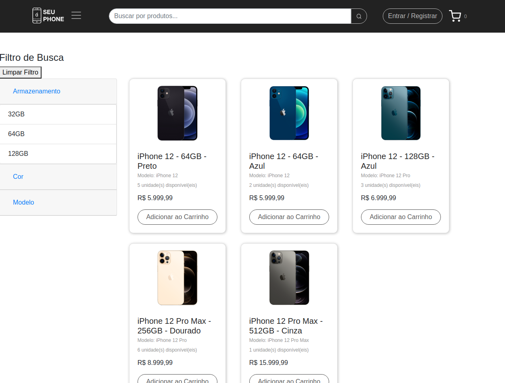
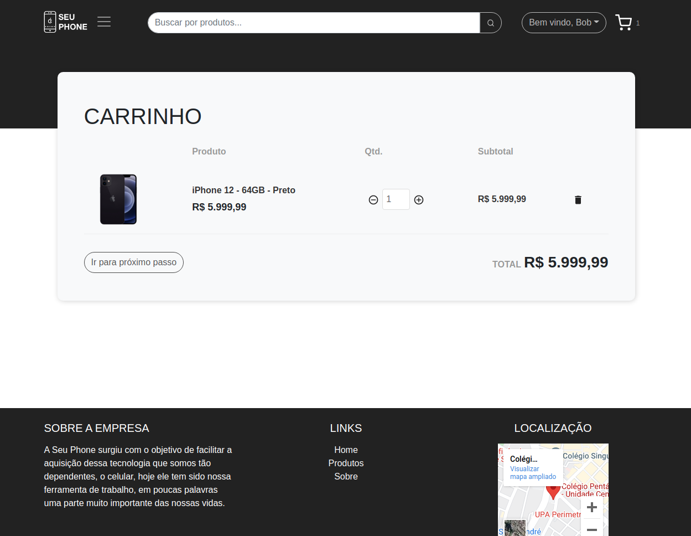
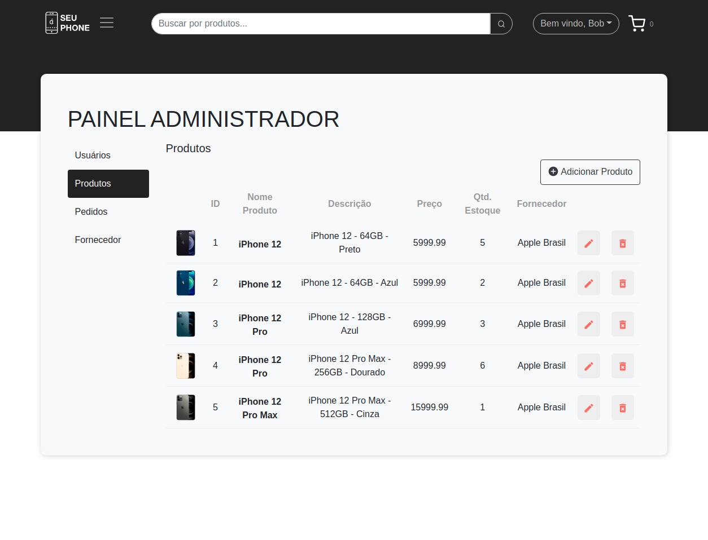

# Seuphone Web
Seuphone web é uma aplicação simulando um e-commerce com diversas funcionalidades.
OBS: Você pode consultar tudo sobre a aplicação no documento localizado na pasta "Documentação" no [repositório do back-end](https://github.com/emersonmelomartins/seuphone-web-backend-api-csharp).

- ⚠️ Atenção
- Esta aplicação está divida entre BACK-END e FRONT-END (Esta página), a outra parte você pode estar [consultando aqui](https://github.com/emersonmelomartins/seuphone-web-backend-api-csharp)
- Essa aplicação trata-se de um projeto do 4 Semestre do curso de Análise e Desenvolvimento de Sistemas da faculdade FAPEN e foi desenvolvida apenas com o intuito de estudos.
- Você pode consultar projetos de outros semestres também:
- [2 Semestre](https://github.com/emersonmelomartins/fapen-seuphone).
- [3 Semestre](https://github.com/emersonmelomartins/fapen-seuphone-ionic).

##  Preview
<p align="left">
  
  
</p>
<p align="left">
  
  
</p>

## Demonstração
Você pode acessar a demonstração da página acessando [este link.](https://emersonmelomartins.dev.br/)
E também a documentação das apis [acessando aqui.](http://api.emersonmelomartins.dev.br/index.html)

```sh
# usuário administrador para testes.
usuário: bob.brown@gmail.com
senha: 123456

# Você também pode criar seu proprio usuário.
```

## Features
- Usuários
- - Criação e atualização de dados;
- - Recuperação de senha;
- Produtos
- - Listagem de produtos (Apenas com estoque);
- - Filtro de busca;
- Carrinho
- - Adição e Remoção de produtos;
- - Atualização de quantidade;
- Pedido de Compra
- - Método de pagamento (Demonstrativo apenas);
- - Atualização de endereço no ato da compra;
- Painel Administrativo;
- - Criação de Usuários;
- - Criação de Pedidos;

## Tecnologias

Esse projeto utiliza:

- [C#] - Linguagem da Microsoft para o desenvolvimento das APIS do back-end;
- [SQL Server] - Banco de dados utilizado para armazenamento de informação;
- [ReactJS] - Biblioteca em javascript para a construção do front-end;
- [Swagger] - Documentação das APIS;
- [.NET Core 3.1] - Versão utilizada no projeto;
- [Entity Framework] - Mapeamento do banco de dados para os models da aplicação.
- Opcional [Docker] - Container para a criação do banco de dados.


## Instalação
Essa aplicação necessita de [Node.js](https://nodejs.org/) instalado para rodar.

Após clonar o repositório, instalar as dependencias.
```sh
npm install
```

Iniciar o projeto.
```sh
npm run start
```

O projeto estará disponível na url:
```sh
http://localhost:3000
```